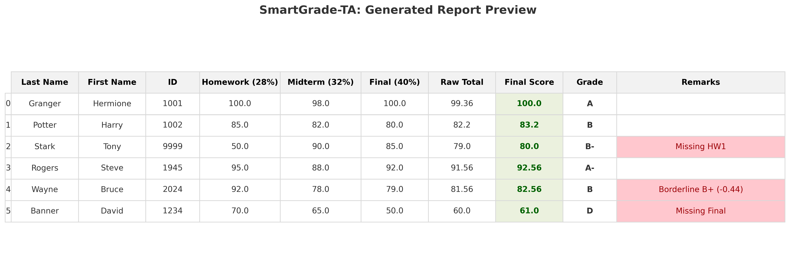

# 🎓 SmartGrade-TA


> **Stop manually formatting spreadsheets. Get your weekends back.** > A privacy-focused automation tool designed for TAs and Instructors at Stony Brook University and beyond.

[🇬🇧 English](#-english-documentation) | [🇨🇳 中文说明](#-中文说明-chinese-documentation)

---

## 📸 Demo & Screenshots


*(Auto-generated report showing color-coded final scores, curve adjustments, and automatic flag detection for missing assignments.)*

---

## 🇬🇧 English Documentation

### ✨ Why SmartGrade-TA?
**SmartGrade-TA** instantly converts raw CSV grade exports (from LMS like Brightspace, Canvas, Blackboard) into professional, scientific-style Excel reports.

It solves the biggest headaches for TAs:
* **Auto-Calculation:** No more manual Excel formulas. Handles weighted totals (e.g., HW 30%, Final 40%).
* **Visual Clarity:** Side-by-side comparison of **Raw Scores** (Grey) vs. **Final Scores with Bonus** (Green Highlight).
* **Red Flag Detection:** Automatically tags:
    * 🚩 **Missing assignments** (0 scores)
    * ⚠️ **"Borderline" students** (e.g., within 0.5 points of the next letter grade - crucial for deciding curve).
* **Privacy First:** Built-in `.gitignore` ensures **student data is NEVER uploaded to GitHub**.
* **Flexible Input:** Smartly recognizes both complex LMS exports (Brightspace/Canvas) AND simple manual CSV files.

### 🚀 Quick Start

#### 1. Installation
Ensure you have Python installed.
```bash
git clone [https://github.com/YourUsername/SmartGrade-TA.git](https://github.com/YourUsername/SmartGrade-TA.git)
cd SmartGrade-TA
pip install -r requirements.txt
2. Prepare Your Data
Export the grade book from your LMS (Brightspace/Canvas) as a .csv file.

Place the file in the project folder.

Note: The script uses fuzzy matching. As long as headers contain "Homework", "Midterm", etc., it works.

3. Configuration (main.py)
Open main.py and adjust the weights at the top. It's designed to be readable even for non-coders:

Python

# 1. Your CSV Filename
INPUT_FILE = 'Your_Course_Export.csv' 

# 2. Grading Weights (Must sum to approx 1.0)
WEIGHTS = {
    'Homework': 0.28,
    'Lab':      0.06,
    'Midterm':  0.32,
    'Final':    0.20,
    'Portfolio': 0.04
}

# 3. Bonus Points (Added to every student's final score)
BONUS_POINTS = 1.0 
4. Run
Bash

python main.py
📊 Output
The tool generates Final_Grades_Report.xlsx containing:

Gradebook: Master list with calculated grades, color-coding, and remarks.

Summary: Grade distribution histogram.

Rubric: Reference sheet of the grading scale.

🛡️ Privacy & Security (FERPA)
Student privacy is the top priority.

Local Processing: This script runs 100% on your local machine. No data is sent to the cloud.

Git Protection: The repository includes a pre-configured .gitignore to exclude *.csv and *.xlsx files. This prevents accidental data leaks to GitHub.

🇨🇳 中文说明 (Chinese Documentation)
📖 项目简介
SmartGrade-TA 是一款专为助教 (TA) 设计的成绩处理自动化工具。它可以将学校系统（如 Brightspace/Canvas）导出的原始 CSV 成绩单，一键转换为排版精美、符合科研习惯的 Excel 报表。

✨ 核心痛点解决方案
- **自动加权计算**：根据你设定的权重（如：作业 30%，期末 40%）自动计算总分，告别手动 Excel 公式。

- **直观的分数对比**：报表中并列展示 “原始分” (灰色) 和 “含加分后的最终分” (绿色高亮)，一目了然。

- **异常与边缘检测**：自动在备注栏标记：

- **智能兼容输入**：既支持 Brightspace/Canvas 导出的复杂原始数据，也支持手写的简单 CSV 表格。

❌ 缺交 (Missing): 作业或考试为 0 分。

🤔 边缘人 (Borderline): 距离下一档等级仅差 0.5 分以内的学生（方便决定是否“捞人”）。

科研风格排版：自动冻结首行首列，关键数据高亮，阅读体验极佳。

🚀 使用步骤
1. 安装
Bash

pip install -r requirements.txt
2. 准备数据
将 LMS 导出的 CSV 成绩单放入项目文件夹。 注：代码支持模糊匹配，表头包含 "Homework", "Midterm" 等关键词即可识别。

3. 修改配置 (main.py)
Python

# 1. 输入文件名
INPUT_FILE = 'Your_Course_Export.csv' 

# 2. 权重配置 (名称需与表头关键词对应)
WEIGHTS = {
    'Homework': 0.28,
    'Midterm':  0.32, # 期中
    'Final':    0.20  # 期末
}

# 3. 全员加分 (例如全班加 1 分)
BONUS_POINTS = 1.0 
4. 运行
Bash

python main.py
📝 License
MIT License. Free for all TAs to use.


